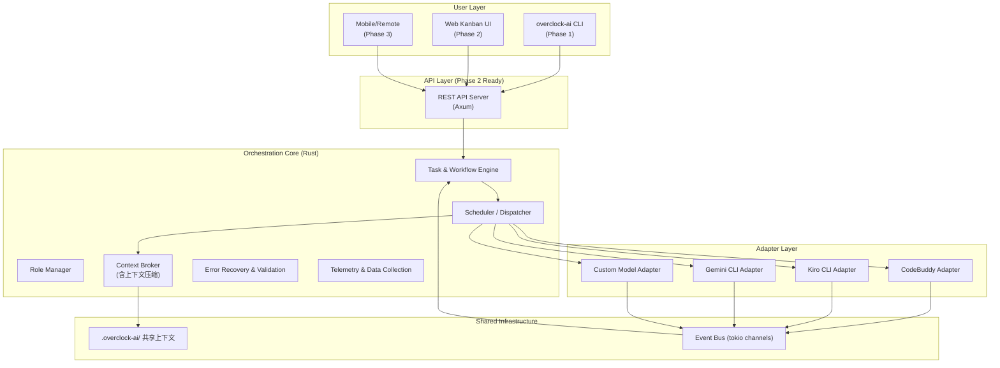
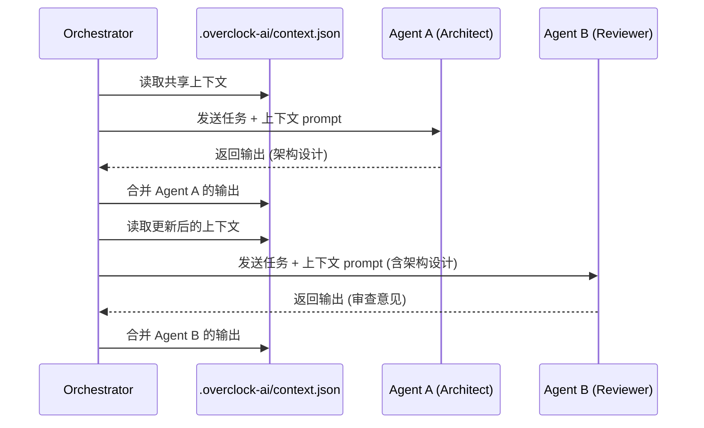

# Overclock-AI Architecture

## 设计理念

Overclock-AI 采用 **隔离式 Agent 编排** 模式：

```
          ┌────────────────────┐
          │   overclock-ai     │
          │   (Orchestrator)   │
          └─────────┬──────────┘
                    │  分配任务 + 注入上下文
      ┌─────────────┼─────────────┐
      ▼             ▼             ▼
 ┌─────────┐  ┌─────────┐  ┌─────────┐
 │CodeBuddy│  │Kiro CLI │  │Gemini CLI│
 │ (隔离)  │  │ (隔离)  │  │ (隔离)  │
 └─────────┘  └─────────┘  └─────────┘
```

### 核心原则

1. **Agent 互不感知**：每个 CLI Agent 只接收自己的任务和上下文，不知道其他 Agent 的存在
2. **Orchestrator 唯一协调者**：所有任务分配、上下文传递、结果收集都由 orchestrator 完成
3. **上下文单向流动**：上游 Agent 的输出经 orchestrator 整理后注入下游 Agent 的上下文
4. **统一适配器接口**：所有 CLI 工具通过统一的 `AgentAdapter` trait 接入

### 系统架构图



## 分层设计

### Layer 1: Core Engine (`overclock-core`)

| 模块 | 职责 |
|------|------|
| `task.rs` | 任务数据模型，状态机 (Pending → Running → Validating → Completed/Blocked)，包含重试阈值与验证标准 (`validation_requirements`) |
| `role.rs` | 角色定义 (Architect/Reviewer/Developer/Tester/Custom)，角色-Agent 绑定 |
| `workflow.rs` | DAG 工作流引擎，支持串行/并行/条件分支，内置预设模板 |
| `context.rs` | 共享上下文协议，包含动态上下文压缩能力，`.overclock-ai/context.json` 为唯一事实来源 |
| `event.rs` | 事件总线 (tokio broadcast)，支持 UI 层实时订阅 |
| `config.rs` | 项目配置管理，读写 `overclock-ai.toml` |
| `telemetry.rs`| **[新增设计]** 数据收集模块，记录执行指标、上下文使用率与失败原因，本地落盘 |
| `recovery.rs` | **[新增设计]** 异常恢复控制流，拦截 CLI Agent 返回的错误，基于问题分类自动决定是重试上下文还是标记异常 |

### Layer 2: Adapter Layer (`overclock-adapters`)

统一适配器 trait `AgentAdapter`：

```rust
#[async_trait]
pub trait AgentAdapter: Send + Sync {
    fn name(&self) -> &str;
    fn agent_type(&self) -> &str;
    async fn health_check(&self) -> HealthStatus;
    async fn execute_task(&self, task, context, config) -> Result<TaskOutput>;
    async fn quota_info(&self, config) -> Result<Option<QuotaInfo>>;
}
```

每个适配器负责：
- 将统一上下文转换为 CLI 原生格式
- 作为子进程调用 CLI 工具
- 解析 CLI 输出为统一的 `TaskOutput`
- 将实时输出事件发送到事件总线

### Layer 3: CLI (`overclock-cli`)

基于 `clap` 的命令行接口，提供 `init`, `config`, `task`, `run`, `status` 命令。

### Layer 4: REST API Server (`overclock-server`)

Phase 2 预留，基于 Axum 提供 REST API + SSE/WebSocket 实时更新。

## 上下文同步机制

### `.overclock-ai/` 目录结构

```
.overclock-ai/
├── context.json          # 共享上下文 (唯一事实来源)
├── tasks/                # 任务定义和状态 (JSON)
├── artifacts/            # Agent 输出产物
├── history/              # 执行历史
└── config.db             # SQLite 持久化 (可选)
```

### 上下文流转过程



## 扩展性

- **新增 CLI 适配器**：实现 `AgentAdapter` trait 即可
- **新增角色**：在 `overclock-ai.toml` 中配置 `[roles.xxx]`
- **自定义工作流**：通过 YAML/TOML 定义 DAG
- **UI 扩展**：通过 REST API + 事件总线对接任何前端
